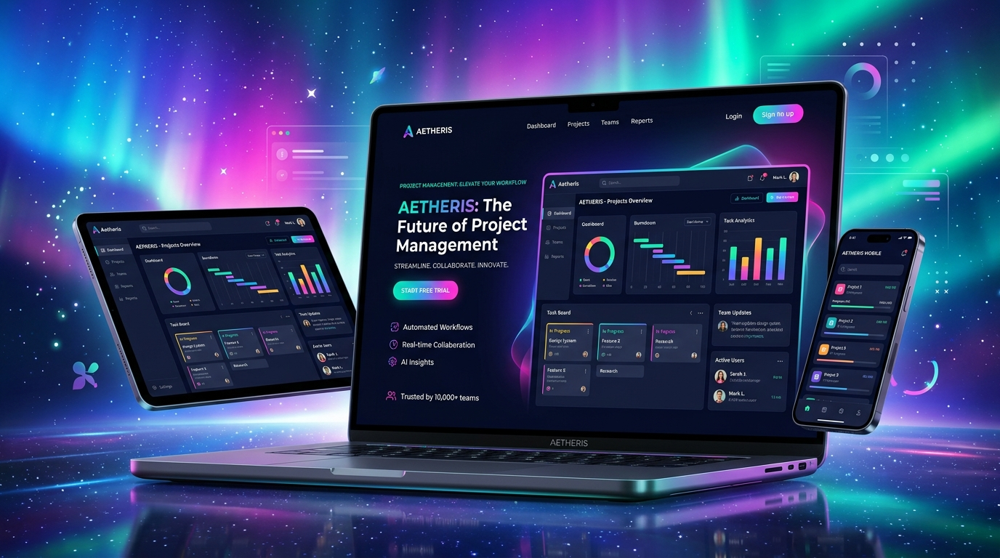

# 🪄 ScreenCap Studio

> **Turn Raw App Screenshots into High-Converting 4K Device Mockups & Marketing Visuals**

<p align="left">
  
  
  
  
</p>

ScreenCap Studio is a web application designed for app developers, founders, and content creators to quickly format raw app screenshots into stunning 4K marketing visual mockups with 3D device frames (iPhone 16 Pro, MacBook Pro, Safari Browser), custom mesh gradients, 3D tilt controls, and instant high-DPI PNG export.

---

## 📸 Screenshots & Showcase

| 4K Marketing Mockup Preview |
| --- |
|  |

---

## ✨ Features

- 📱 **3D Device Frames**:
  - **iPhone 16 Pro**: Titanium bezel, Dynamic Island notch
  - **MacBook Pro**: Aluminum body chassis, notch, keyboard lip
  - **Browser Window**: Safari/Chrome window controls & URL bar
  - **Minimalist Card**: Rounded corners, subtle glass stroke
- 🎨 **Mesh Gradients & Atmosphere**:
  - Aurora Indigo, Sunset Amber, Midnight Cyber, Emerald Mint, Monochrome Dark, and Custom HEX colors.
- 📐 **3D Perspective & Tilt**:
  - Sliders for 3D Pitch (Rotate X), Yaw (Rotate Y), Padding, Corner Radius, and Drop Shadows.
- 📐 **Preset Aspect Ratios**:
  - `16:9` (ProductHunt / Twitter)
  - `1:1` (Instagram Square)
  - `9:16` (Story / Reel / Shorts)
  - `4:3` (App Store / Dribbble)
- ✍️ **Headline & Subtitle Overlays**:
  - Add marketing headlines and descriptions directly on the image canvas.
- 📥 **4K PNG Client-Side Export**:
  - Instant high-res download, 100% private in browser with zero server uploads required.

---

## 🚀 Quick Start

1. Clone this repository:
   ```bash
   git clone git@github.com:rodeiroigor88-hash/Memex-Canvas.git
   cd Memex-Canvas
   ```

2. Open `index.html` directly in your web browser by double-clicking it, or serve using any static web server:
   ```bash
   npx serve .
   ```

---

## 📄 License

MIT © 2026 Igor Rodeiro
